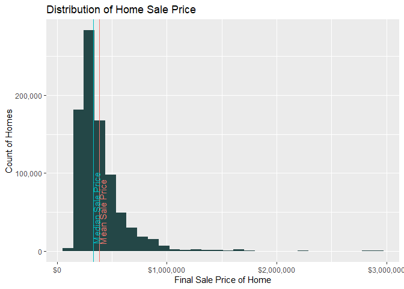

New Constuction Home Analysis
================
Nolan Peterson
1/8/2022

## Introduction

The aims of this analysis are:

  - Observe and analyze the trends and relevant statistics for the new
    construction home market.

  - Build a model to predict new home sale prices based off of selected
    features.

## Data

The data for this analysis comes from the Census Bureau’s 2020 Survey of
Construction. This is a survey of new construction homes across the US
which compiles details regarding the construction methods used, physical
specifications of the home as well as some legal/financial details
surrounding the home. The data can be found here:
<https://www.census.gov/construction/chars/microdata.html>

### Key Insights

  - Raw data has 25,526 observations and 61 variables.

  - Cleaned data has 12,443 observations and 39 variables.

  - Cleaned data has 30 categorical predictors, 4 continuous predictors,
    1 sample weight variable, and 1 continuous response.

  - Code for data cleaning can be found here:
    <https://github.com/NolanPeterson453/New-Construction-Analysis-/blob/main/01_scripts/data_cleaning.R>

### Cleaning Steps

#### Variable Selction

Not all variables in raw data set were useful for this analysis. There
were primarily three reasons why variables would be removed.

  - The variable was a flag variable.

  - The variable had low or no predictive power.

  - The variable was proxy for the target response variable.

For example, the variable SQFS\_F was removed because this variable
because this variable simply indicates if the Census Bureau has at all
modified the reported value. Examples of modification to the reported
value include top-coding, rounding or imputation. The second reason for
removal (lack of predictive power), was used for variables such as ID or
variables describing financing (loan type, etc…). These variables do not
add any useful information to this analysis. The third type of variables
removed, are variable which describe essentially the same thing thing as
the response. That is they describe the value of the home in some
measure.

#### Reported Vs Final Observations

In the raw data set there are several variables which have both reported
and ‘final’ reported counterparts. Take for example the variables SQFS
(area of home in square feet) and FSQFS (final area of home in square
feet). In cases where the home’s final square footage area was different
that what was specified in the building permit or contract, the final
value is reported in the variable FSQFS. Otherwise the value of FSQFS is
0. In order to simplify the data while still maintaining the accuracy of
the reported values the two variables SQFS and FSQFS where merged into a
single variable which has the value of FSQFS when it is not 0 and the
value of SQFS when FSQFS is 0.

There is a similar situation for the response SLPR (sale price) and
FSLPR (final sale price). FSLPR reports a value when the final sale
price is different than what is specified in the contract and is 0
otherwise. These two variables were merged in the exact same way as SQFS
and FSQFS.

#### Missing Values

There is a substantial amount of unreported values within the data set.
For the categorical predictors missing data is simply coded in as an
“unreported” or “non-applicable” level in the variable. For continuous
variables, unreported values are imputed with the mean value of the
reported observations.

#### Observation Selection

Only observations where the home was sold were kept in the final data
set. This is because sale price is the being used as the primary proxy
for home value.

## Exploritory Data Analysis

### Key Insights

  - Distribution of home sale price is right skewed with the vast
    majority of homes selling for between $100,000 and $750,000.

### Sale Price of Home

``` 
   Min. 1st Qu.  Median    Mean 3rd Qu.    Max. 
 124000  265000  350000  411802  484000 2950000 
```

    Mean Sale Price $411801.82.

    Median Sale Price $350000.

<!-- -->
