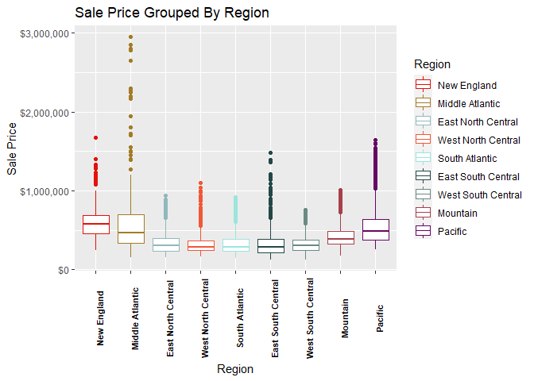
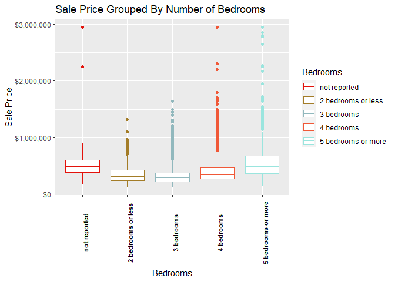
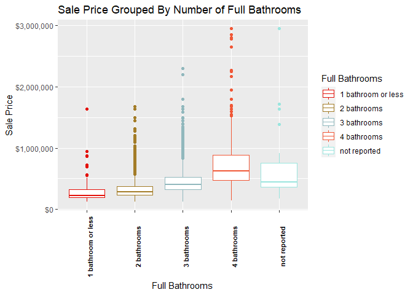
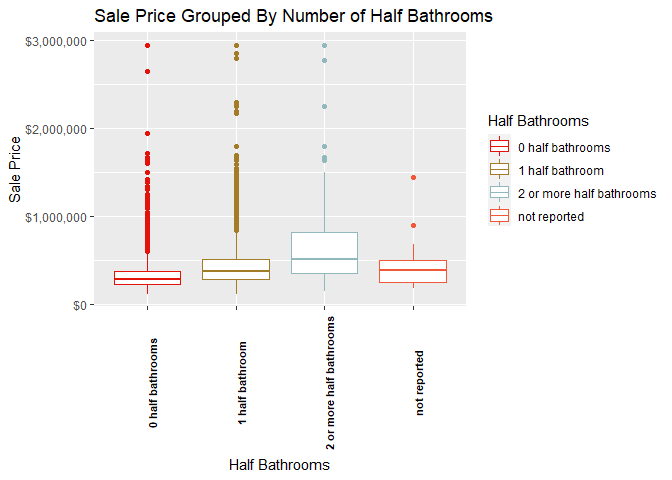

New Constuction Home Analysis
================
Nolan Peterson
1/8/2022

## Introduction

The aims of this analysis are:

  - Observe and analyze the trends and relevant statistics for the new
    construction home market.

  - Build a model to predict new home sale prices based off of selected
    features.

## Data

The data for this analysis comes from the Census Bureau’s 2020 Survey of
Construction. This is a survey of new construction homes across the US
which compiles details regarding the construction methods used, physical
specifications of the home as well as some legal/financial details
surrounding the home. The data can be found here:
<https://www.census.gov/construction/chars/microdata.html>

### Key Insights

  - Raw data has 25,526 observations and 61 variables.

  - Cleaned data has 12,443 observations and 39 variables.

  - Cleaned data has 30 categorical predictors, 4 continuous predictors,
    1 sample weight variable, and 1 continuous response.

  - Code for data cleaning can be found here:
    <https://github.com/NolanPeterson453/New-Construction-Analysis-/blob/main/01_scripts/data_cleaning.R>

### Cleaning Steps

#### Variable Selction

Not all variables in raw data set were useful for this analysis. There
were primarily three reasons why variables would be removed.

  - The variable was a flag variable.

  - The variable had low or no predictive power.

  - The variable was proxy for the target response variable.

For example, the variable SQFS\_F was removed because this variable
because this variable simply indicates if the Census Bureau has at all
modified the reported value. Examples of modification to the reported
value include top-coding, rounding or imputation. The second reason for
removal (lack of predictive power), was used for variables such as ID or
variables describing financing (loan type, etc…). These variables do not
add any useful information to this analysis. The third type of variables
removed, are variable which describe essentially the same thing thing as
the response. That is they describe the value of the home in some
measure.

#### Reported Vs Final Observations

In the raw data set there are several variables which have both reported
and ‘final’ reported counterparts. Take for example the variables SQFS
(area of home in square feet) and FSQFS (final area of home in square
feet). In cases where the home’s final square footage area was different
that what was specified in the building permit or contract, the final
value is reported in the variable FSQFS. Otherwise the value of FSQFS is
0. In order to simplify the data while still maintaining the accuracy of
the reported values the two variables SQFS and FSQFS where merged into a
single variable which has the value of FSQFS when it is not 0 and the
value of SQFS when FSQFS is 0.

There is a similar situation for the response SLPR (sale price) and
FSLPR (final sale price). FSLPR reports a value when the final sale
price is different than what is specified in the contract and is 0
otherwise. These two variables were merged in the exact same way as SQFS
and FSQFS.

#### Missing Values

There is a substantial amount of unreported values within the data set.
For the categorical predictors missing data is simply coded in as an
“unreported” or “non-applicable” level in the variable. For continuous
variables, unreported values are imputed with the mean value of the
reported observations.

#### Observation Selection

Only observations where the home was sold were kept in the final data
set. This is because sale price is the being used as the primary proxy
for home value.

## Exploritory Data Analysis

### Key Insights

  - Distribution of home sale price is right skewed with the vast
    majority of homes selling for between $125,000 and $750,000.

  - There is a strong association between region of home and sale price.

  - There is a moderate association between size of home and sale price
    with interesting patterns to be explored.

  - Code relating to this section can be found here:
    <https://github.com/NolanPeterson453/New-Construction-Analysis-/blob/main/01_scripts/explor_analysis_viz.R>

### Sale Price of Home

THe sale price of the home is of particular interest because it can be
used as a proxy of home value. It will be modeled as the response
variable later on. For now though, there is a lot of information that
can be gained with some simple analysis. The distribution of sale price
is approximately normal with a right skew.

``` 
   Min. 1st Qu.  Median    Mean 3rd Qu.    Max. 
 124000  252000  328000  384892  450000 2950000 
```

    Mean Sale Price $384891.65.

    Median Sale Price $328000.

<!-- -->

#### Region of Home and Sale Price

It would not be illogical to assume that sale price depends the region
which the home is located in. For example property values in west coast
region are known to generally higher than the mid-west. This
relationship can be visualized by using grouped box plots. As seen below
the median sale price of homes in the East North Central, West North
Central, South Atlantic, East South Central, and West South Central
regions are roughly equal. While the median sale prices in the New
England, Middle Atlantic, Mountain, and Pacific regions are all greater.

<!-- -->

To formally test weather an association exists between the sale price of
the home and the region in which the home is located an analysis of
variance (anova) can be conducted. The anova uses an F-test to test the
following hypothesis:

H\_0: There is no association between sale price and region.

H\_a: There is an association between sale price and region.

    Analysis of Variance Table
    
    Response: FSLPR
                 Df     Sum Sq    Mean Sq F value    Pr(>F)    
    DIV           8 7.3933e+15 9.2416e+14  342.33 < 2.2e-16 ***
    Residuals 12434 3.3567e+16 2.6996e+12                      
    ---
    Signif. codes:  0 '***' 0.001 '**' 0.01 '*' 0.05 '.' 0.1 ' ' 1

As can be seen in the above anova table the p-value resulting from the
F-test would result in the null hypothesis being rejected at the alpha =
0.001 level. **In other words there is a statistically significant
association between sale price and the region of the home.**

#### Size of Home and Sale Price

The most obvious metric of home size is square footage. Using the
correlation as a measure of association the r-squared value of 0.58
indicates a moderate association.

    The correlation between sale price and square footage is 0.58.

Furthermore a linear model which predicts sale price using only square
feet of home as a predictor in order to better understand the
relationship between these two numbers.

``` 

Call:
lm(formula = FSLPR ~ FSQFS, data = soc_data, weights = WEIGHT)

Weighted Residuals:
     Min       1Q   Median       3Q      Max 
-5313818  -674813  -158664   515115 21759024 

Coefficients:
            Estimate Std. Error t value Pr(>|t|)    
(Intercept) 31795.34    4700.63   6.764  1.4e-11 ***
FSQFS         142.03       1.78  79.802  < 2e-16 ***
---
Signif. codes:  0 '***' 0.001 '**' 0.01 '*' 0.05 '.' 0.1 ' ' 1

Residual standard error: 1476000 on 12441 degrees of freedom
Multiple R-squared:  0.3386,    Adjusted R-squared:  0.3385 
F-statistic:  6368 on 1 and 12441 DF,  p-value: < 2.2e-16
```

Using a T-test it is determined that square footage of a home is a
significant predictor of sale price. It can also be shown from the
linear model that for every one unit increase in square footage the sale
price of the home is expected to rise by $142.03.

Other metrics of home size can also be useful predictors. For instance
the number of bedrooms, bathrooms and half bathrooms are all variables
which in addition to indicating the overall size of the house will
provide information that can yield a more accurate estimate of sale
price.

<!-- --><!-- --><!-- -->

Interestingly homes with exactly 3 bedrooms have lowest median sale
price when grouping sale price by the number of bedrooms a home has. The
likely reason for this is that number of bedrooms is interacting with
the location of the home. The data set does not specify if the home is
located in a rural or urban area, however it would not be illogical to
assume that 3 bedroom homes are the most common in rural areas where
property values are low. This same behavior does not exist with with the
number of bathrooms and half bathrooms. There is a high marginal cost
associated with adding additional bathrooms to a home (due to the
expensive fixtures and additional labor required). This cost must be
reflected in the sale price of the home regardless of the location of
the home.
